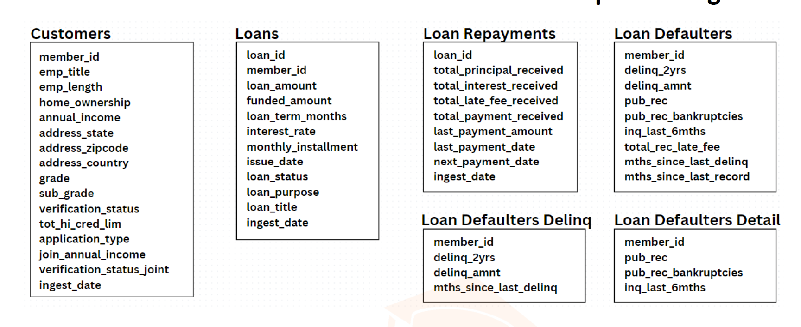

---

# Apache PySpark Project - Credit_Score_Calculator


## Overview
This Apache PySpark project is part of the Ultimate Big Data Masters Program (Cloud Focused) and focuses on calculating loan scores based on various factors such as payment history, financial health, and default history. The project utilizes PySpark to process and analyze loan-related data to derive insights and aid decision-making.




## Project Structure
- **Data Cleaning and Processing:** Scripts to clean data related to loan payment histories, customer financial health, and loan defaulters. Creating processed DataFrames and writing the data back in both CSV and PARQUET formats.
- **Data Analysis:** Scripts to create external tables and views for analyzing processed data.
- **Loan Score Calculation:** A detailed implementation of the loan score calculation logic based on predefined criteria.

## Installation

### Prerequisites
- Apache Spark
- Python 3.x
- PySpark
- Access to a Hadoop Distributed File System (HDFS) or a local filesystem for storage

### Setup
1. Clone the repository:
   ```bash
   git clone [repository-url]
   cd [project-directory]
   ```
2. Install required Python packages:
   ```bash
   pip install -r requirements.txt
   ```

## Usage
To run the project scripts, navigate to the project directory and use the following command:
```bash
spark-submit --master local[4] script_name.py
```
Replace `script_name.py` with the actual name of the script you want to execute.

## Configuration
Modify the `config.py` file to update paths or parameters according to your environment setup. This includes specifying the paths for input data and locations for storing outputs.

## Data Model
- **Input Data**: Includes loan repayment history, public records, bankruptcies, inquiries, and customer financial data.
- **Processed Data**: DataFrames that aggregate and cleanse the input data to prepare it for analysis.
- **Output Data**: Includes detailed records and summary statistics useful for downstream analysis and reporting.

## Features
- **Data Cleaning**: Scripts to identify and remove bad data, such as duplicate records.
- **Loan Score Calculation**: Comprehensive calculation of loan scores using various metrics like loan repayment history (20%), loan defaulters history (45%), and financial health (35%).

## Business Problem Statement

**Business requirement 1**  Teams are required to analyze the cleaned data which requires the creation of permanent tables on top of the cleaned data that allow the downstream teams to query the data using simple SQL-like queries. (External tables are preferred over Managed Tables)

**Business requirement 2** The teams require a single consolidated view of all the datasets with the latest up-to-date data. (Best practice is to create a view after the data is refreshed over 24 hours, if its running every 24 hrs, no data will be older than 24 hrs, this is preferred over an SQL query because it will take time to generate the view if no further analytics is required ) 

**Business requirement 3** Another team wants real quick access to the “view data” without having to wait for the view results to be processed. Since processing the results takes a very long time. (We can have a weekly join of data creation but in this case, the data may not be the latest, however, the team does not have to wait for quick access Managed table will be used)

---


